# Setup Instructions for IBM Cloud Account

In order to complete the Kubernetes 101 workshop at LISA you'll need
the ability to provision a Kubernetes Cluster. We are providing IBM
Cloud Accounts with Promo codes to do this. This is a detailed walk
through of that process.

<style>
    img {
        border: 2px #445588 solid;
    }
</style>

## Step 1: Register for IBM Cloud with the LISA url

Go to [https://ibm.biz/kube101-lisa](https://ibm.biz/kube101-lisa) to start the registration.

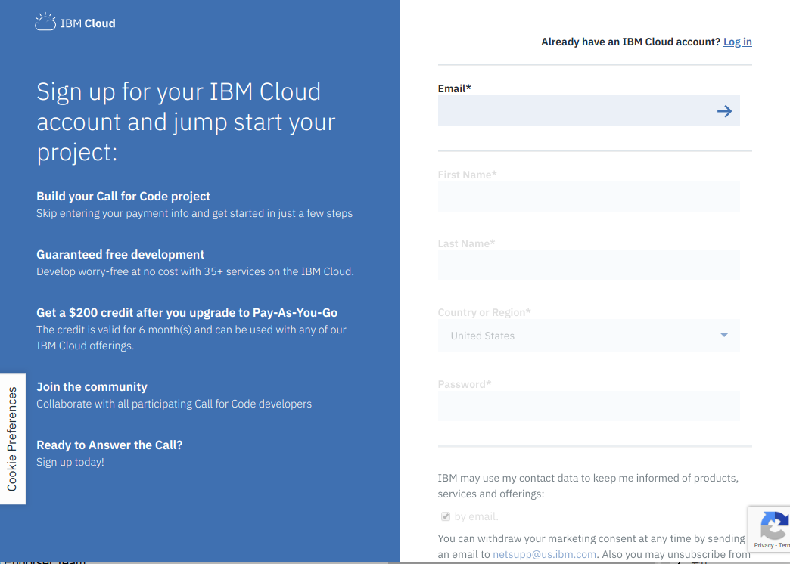

Fill out all the require information and the CAPTCHA and
submit. You'll get a confirmation page like:

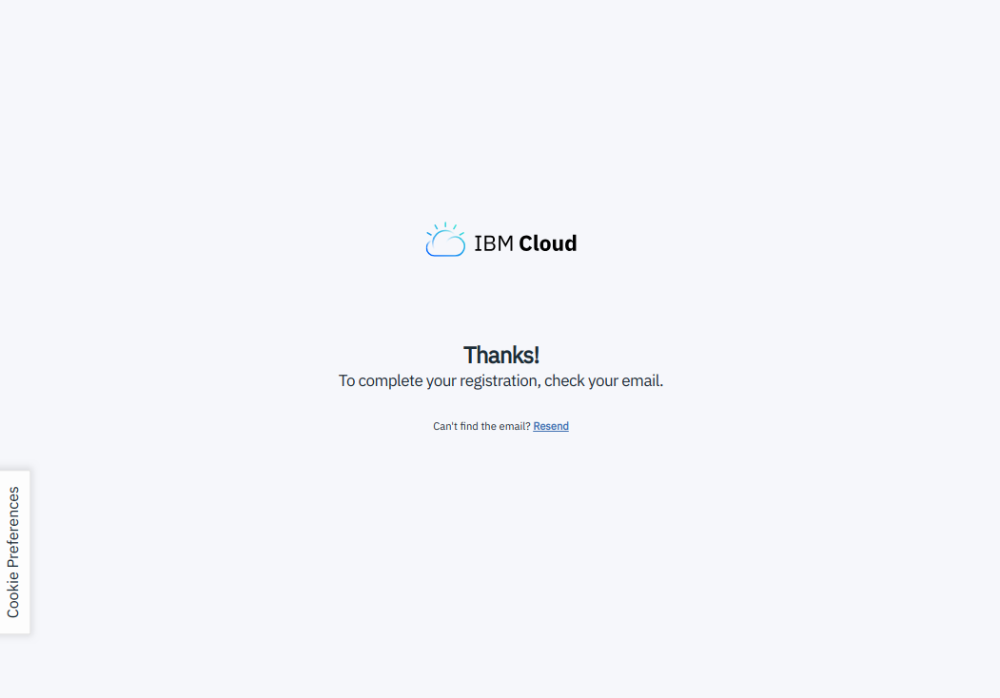

## Step 2: Confirm Email

Check your email and confirm your account. This will take you to an
IBM coders site. You can ignore this.

## Step 3: IBM Cloud Console

Navigate to the [Dashboard](https://console.bluemix.net/dashboard/apps/)

It will ask you to login:

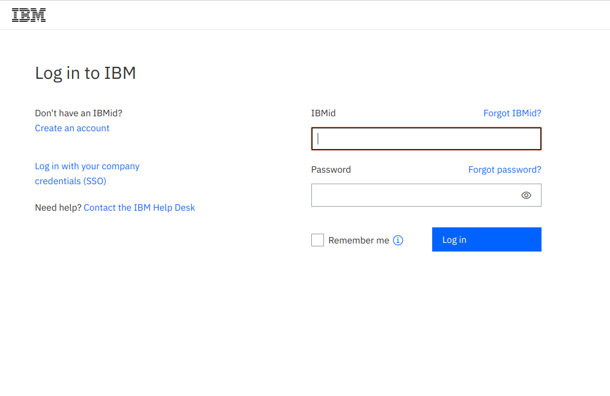

## Step 4: Add Promo Code

Click on the upper right icon that looks like a "person", and click on
the **Profile** link.

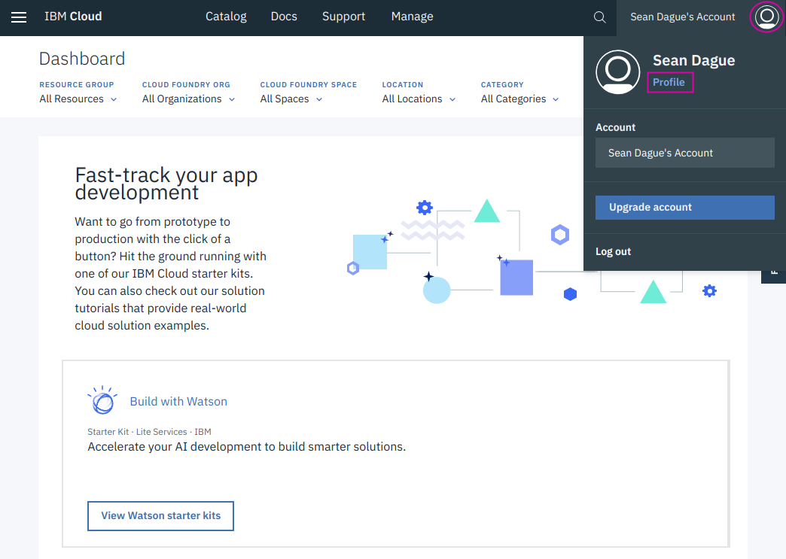

From the profile page click on the [Billing](https://console.bluemix.net/account/billing)

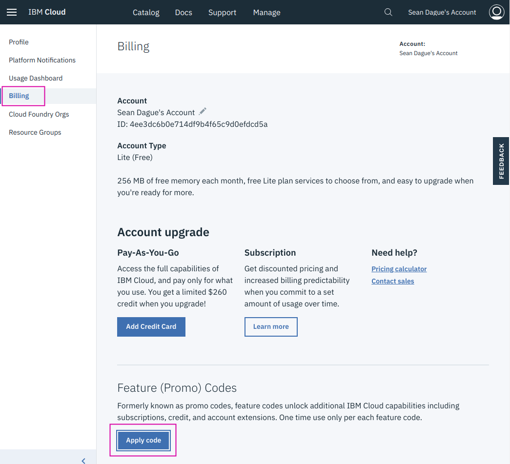

You will be getting a Promo Code from the Google Drive link specified
in the workshop. Take one from there. Add it with the Add Promo Code
Screen.

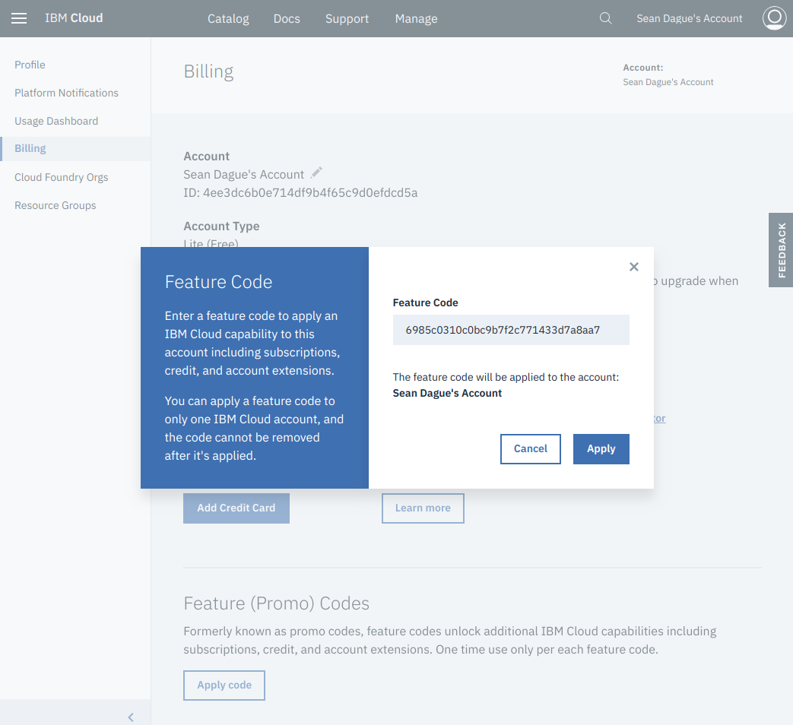

## Step 5: Provision Kube Cluster

First navigate to the [Catalog](https://console.bluemix.net/catalog/).

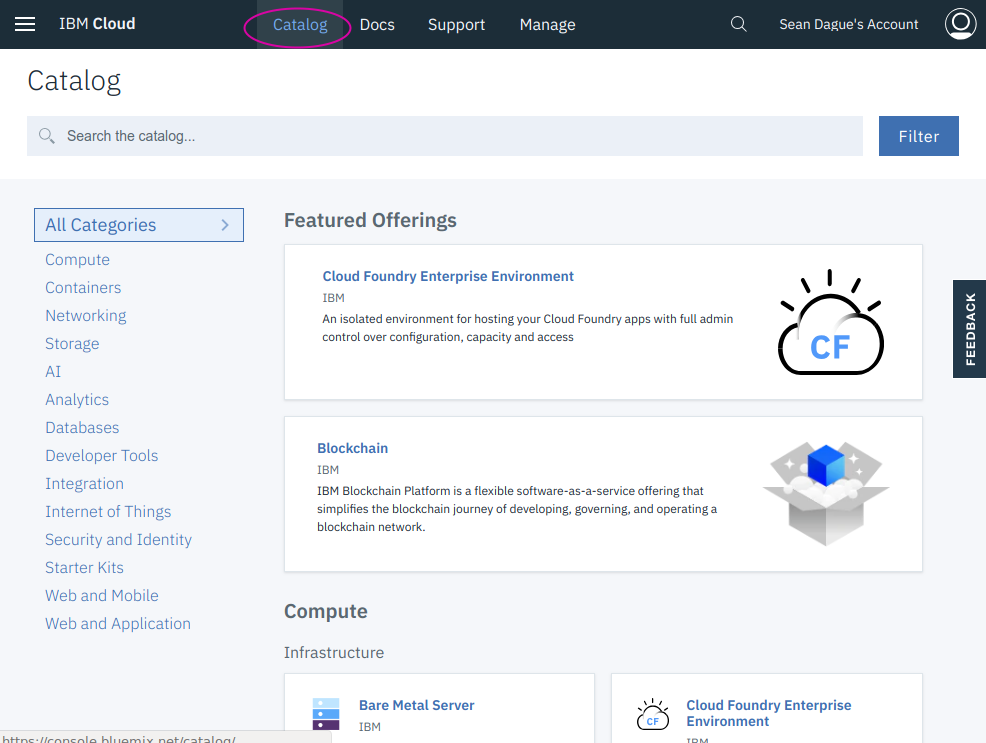

There are lots of services available here, so the best bet is to start
typing ``kube`` in the search field to find the IBM Kubernetes
Service.

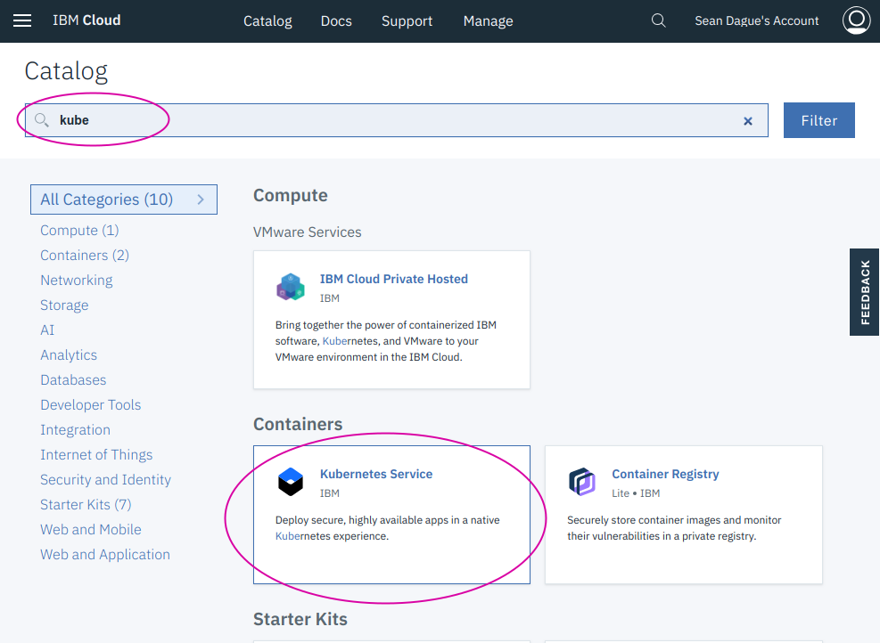

Click on Create.

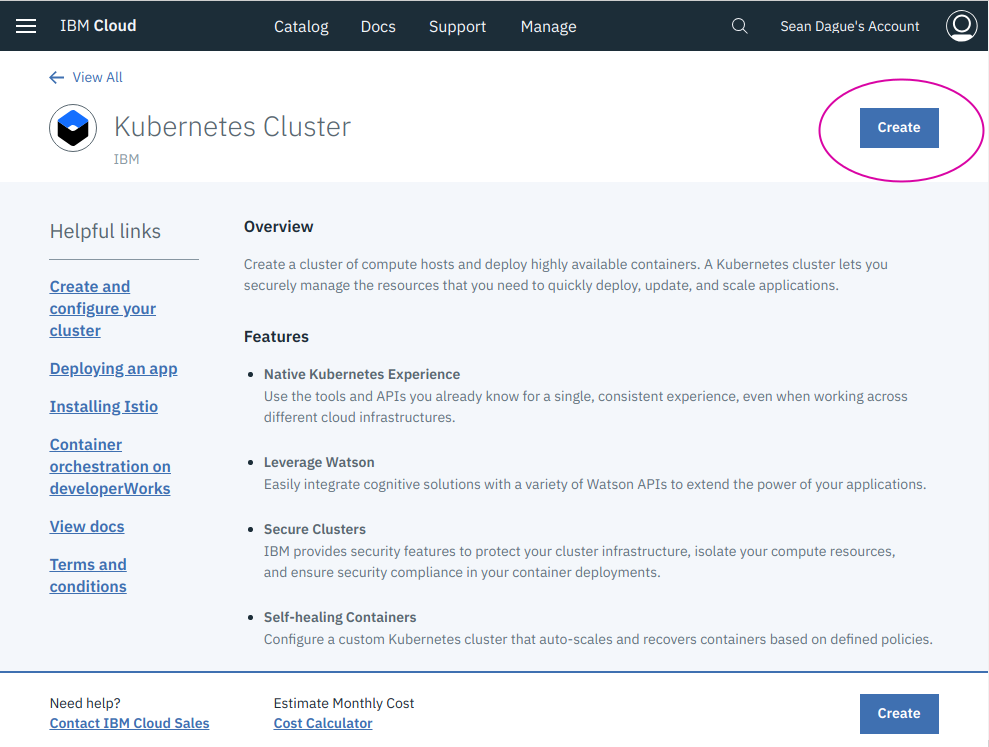

Create a cluster. Be sure to do the following things:

* Set the region to **US South**
* Select Free Cluster
* Name the cluster **kubelisa**

You can name it anything you want, but the commands examples use
kubelisa as the name for consistency.

Then click on create.

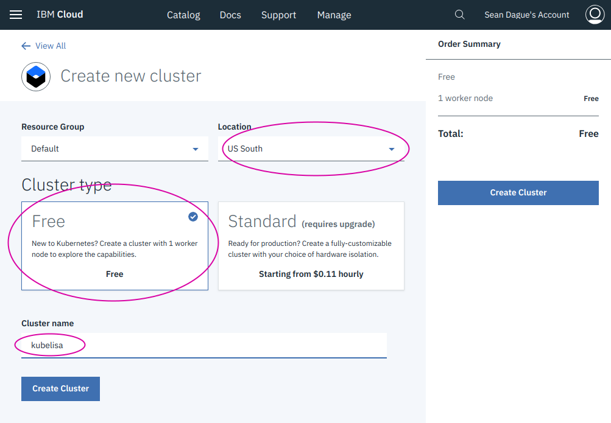

Afterwards you can see the status of the cluster here

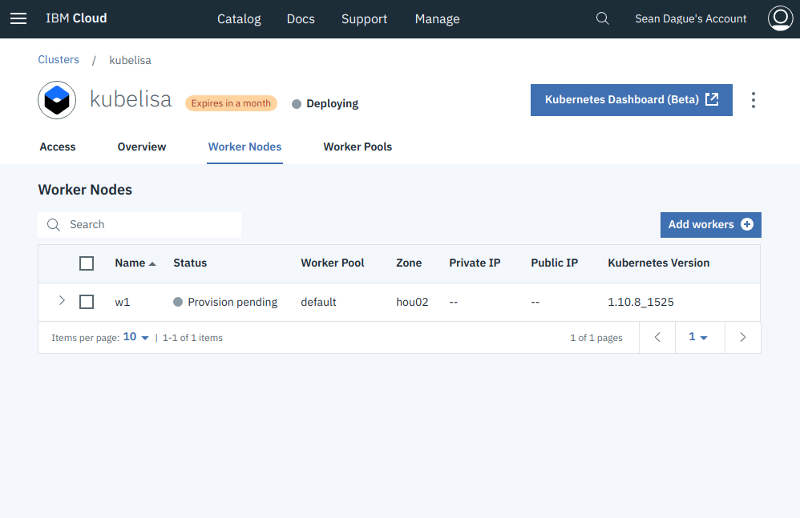

## Step 6: Install Developer Tools

You will need the following tools to complete the tutorial:

* curl - for downloading tools
* git - for downloading the git repo
* ibm cloud cli - for interacting with ibm cloud
* kubectl - for interacting with kubernetes

### Choice #1: All in One Installer

The
[All in One](https://github.com/IBM-Cloud/ibm-cloud-developer-tools)
installer for these tools works on Mac / Linux / Windows.

This is the simplest install method for the tools, but it does install
additional tools beyond what's minimally needed for this workshop.

### Choice #2: Manual Installation

If you want to do a more manual installation of tools, you can do that
as well, here is what you'll need. These instructions are only for
Linux or Mac because it is more complicated to get these tools
installed on Windows.

#### Install curl / git

**On Ubuntu Linux:**

```
> sudo apt install curl git
```

**On Mac:**

curl comes with the system

```
> brew install git
```

#### Install IBM Cloud Cli

**On Linux:**

```
> curl -fsSL https://clis.ng.bluemix.net/install/linux | sh
```

**On Mac:**

```
> curl -fsSL https://clis.ng.bluemix.net/install/osx | sh
```

You then need to install the Container plugins for IBM Cloud

```
> ibmcloud plugin install -r "IBM Cloud" container-service
> ibmcloud plugin install -r "IBM Cloud" container-registry
```

#### Install Kubectl

**On Linux:**

```
> curl --progress-bar -LO https://storage.googleapis.com/kubernetes-release/release/$(curl -s https://storage.googleapis.com/kubernetes-release/release/stable.txt)/bin/linux/amd64/kubectl
> sudo mv kubectl /usr/local/bin
> sudo chmod +x /usr/local/bin/kubectl
```

**On Mac:**

```
> curl --progress-bar -LO https://storage.googleapis.com/kubernetes-release/release/$(curl -s https://storage.googleapis.com/kubernetes-release/release/stable.txt)/bin/darwin/amd64/kubectl
> sudo mv kubectl /usr/local/bin
> sudo chmod +x /usr/local/bin/kubectl
```
